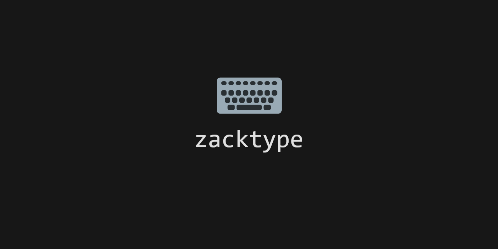
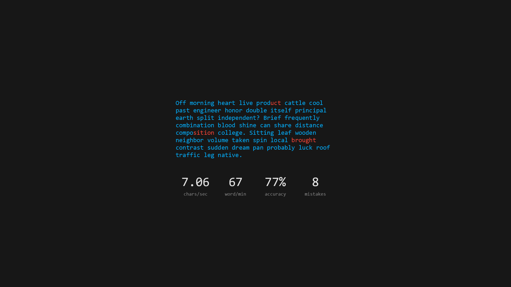

## Goals of this project

- Measure typing speed with a simple test
- Minimalistic front end (no framework)
- Have most of the game logic in its own class, separate from the front end, so writing unit tests is much simpler (only expose some stores)

## TODO

- [X] Be able to actually play the game, which means:
  - [X] Calculate and display CPS
  - [X] Implemented a "game over" state
  - [X] Be able to reset the game and play again
  - [X] Count errors
  - [X] Handle user input
  - [X] Handle backspace
- [X] Design a minimalistic front end
  - [X] Mockup
  - [X] Website
- [X] Calculate and display accuracy
- [X] Calculate and display WPM
- [ ] More unit tests
- [ ] Make PWA-ready
- [X] Maybe make a light and dark theme?
- [ ] Maybe add some settings?
- [ ] Maybe use quotes instead of random text?

## Mockups

